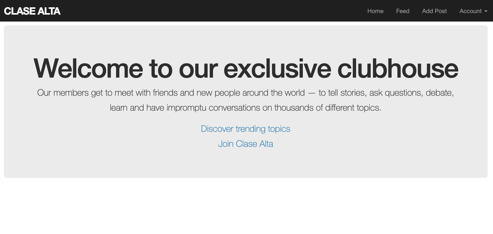

## Project Name: Members Only! blog

### Objective:
Implementing authentication systems so users can only access areas and view content of a site they are authorized to.

## Features

> The front end ( `http://localhost:3000/` ) displays the landing page of the blog, where the user can sign-in, sign-up or look at all the posts.
> The posts will only show authors to signed-in users.
> After a post was successfully created, the user gets redirected to the feed.

## Prerequisites
- Ruby
- Rails
- SQLite3
- Node.js
- Yarn

## Getting Started
- Open your terminal - Windows: `Win + R`, then type `cmd` | Mac: `Command + space`, then type `Terminal`
- Navigate to a directory of your choosing using the `cd` command
- Run this command in your OS terminal: `git clone git@github.com:MiguelArgentina/members-only.git` to get a copy of the project.
- Navigate to the project's directory using the `cd` command
- Install dependencies running `bundle install`
- Run migrations to get the databases using: `rails db:migrate`
- Execute `rails s` to fire up the server
- Visit `http://localhost:3000/` to see the form on your browser
- The user can interact with the blog using the link in the nav bar. To sign up, they can use the `Become a member` link
- To terminate the server, enter `Ctrl + C` in your terminal

## Authors

👤  &nbsp; **Miguel Ricardo Gomez**
- GitHub: [@MiguelArgentina](https://github.com/MiguelArgentina)
- Twitter: [@Qete_arg](https://twitter.com/Qete_arg)
- LinkedIn: [Miguel Ricardo Gomez](https://www.linkedin.com/in/miguelricardogomez/)

👤 &nbsp; **Ubong George**
- GitHub: [@george-swift](https://github.com/george-swift)
- Twitter: [@\_\_pragmaticdev](https://twitter.com/__pragmaticdev)

## Acknowledgments

Ruby on Rails Guide for technical information on how to be productive with Rails

## Show your support

Give a :star:️ &nbsp; if you like this project!

## License

Available as open source under the terms of the [MIT License](https://opensource.org/licenses/MIT).
